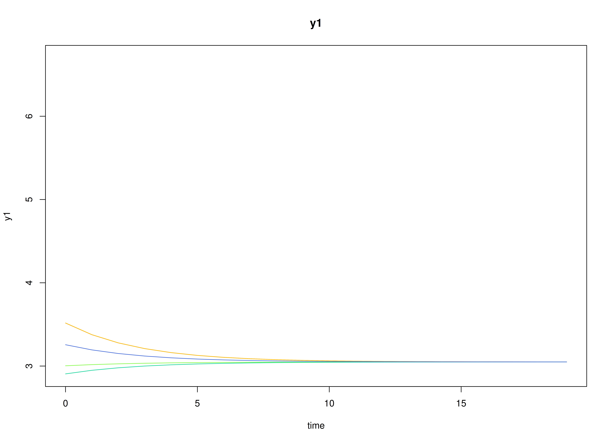
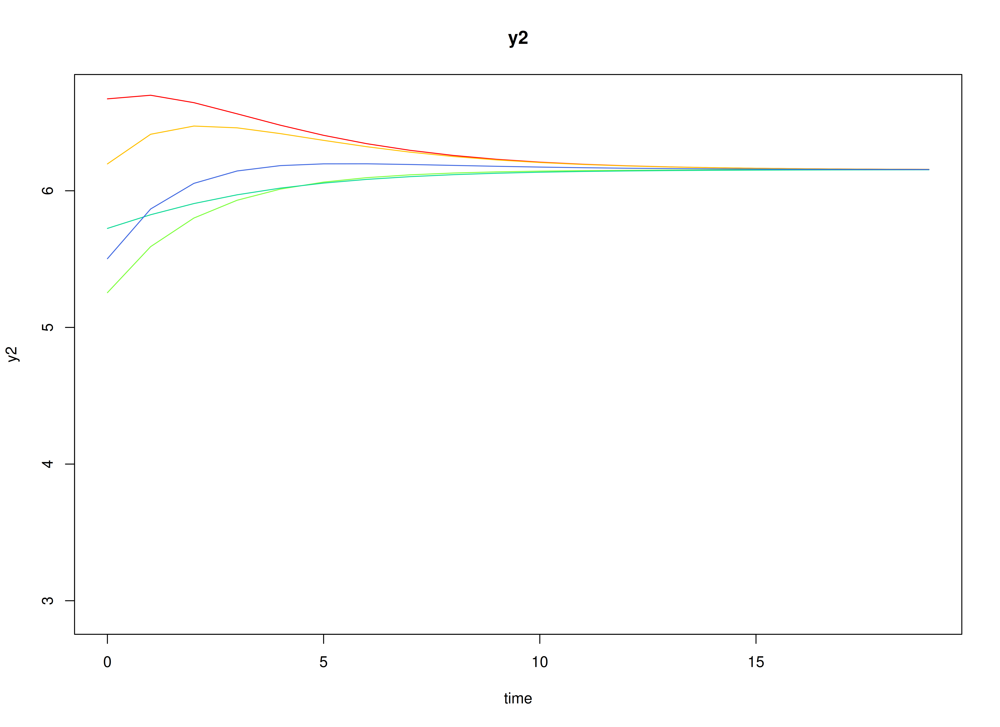
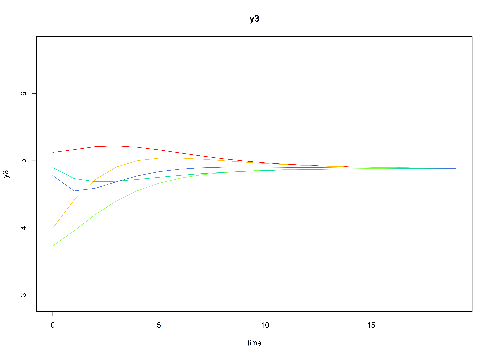
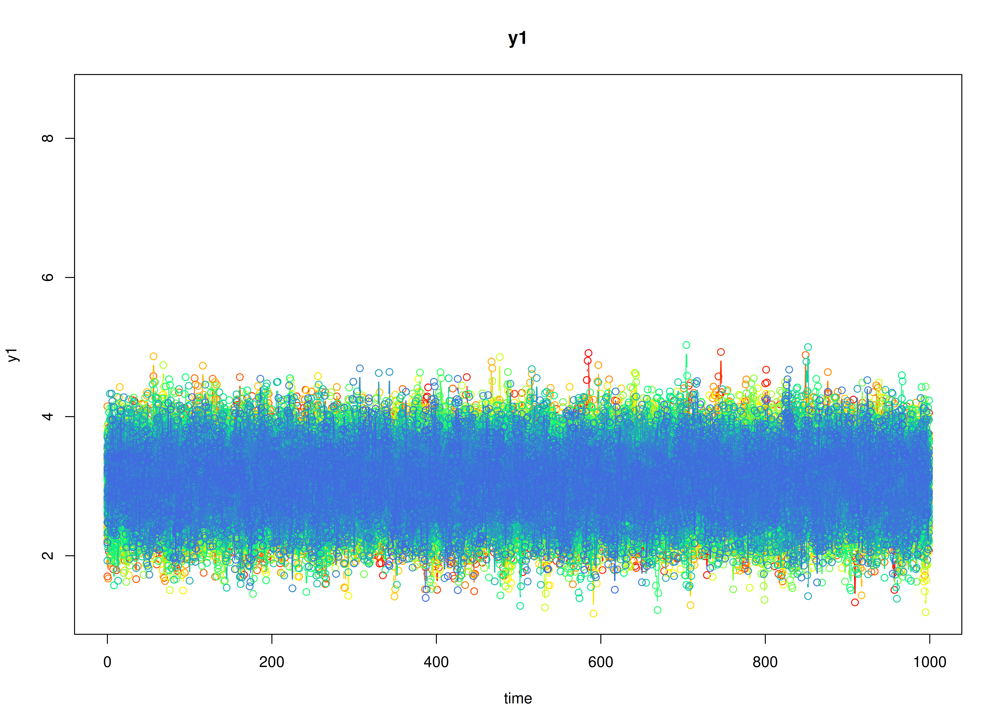
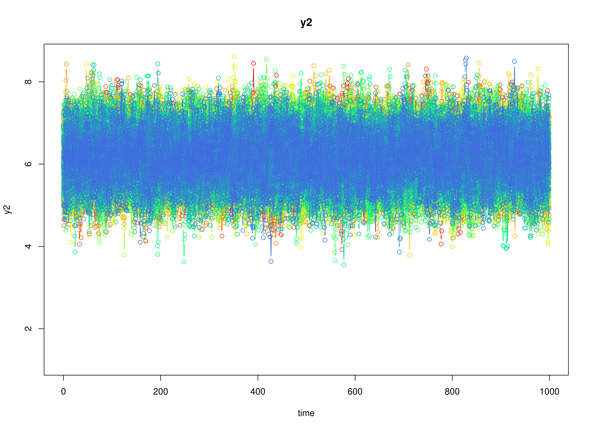
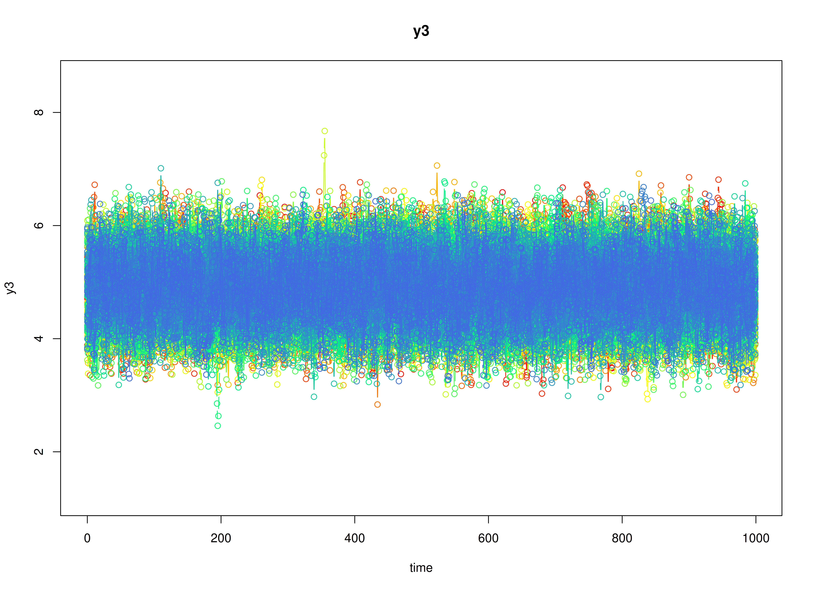

# Discrete-Time Vector Autoregressive Model (center = TRUE)

## Model

The measurement model is given by
``` math
\begin{equation}
  \mathbf{y}_{i, t}
  =
  \boldsymbol{\eta}_{i, t}
\end{equation}
```
where $`\mathbf{y}_{i, t}`$, and $`\boldsymbol{\eta}_{i, t}`$ are random
variables.

The dynamic structure is given by
``` math
\begin{equation}
  \boldsymbol{\eta}_{i, t}
  =
  \boldsymbol{\mu}
  +
  \boldsymbol{\beta}
  \left(
  \boldsymbol{\eta}_{i, t - 1}
  -
  \boldsymbol{\mu}
  \right)
  +
  \boldsymbol{\zeta}_{i, t}
  \sim
  \mathcal{N}
  \left(
  \mathbf{0},
  \boldsymbol{\Psi}
  \right)
\end{equation}
```
where $`\boldsymbol{\eta}_{i, t}`$, $`\boldsymbol{\eta}_{i, t - 1}`$,
and $`\boldsymbol{\zeta}_{i, t}`$ are random variables, and
$`\boldsymbol{\mu}`$, $`\boldsymbol{\beta}`$, and $`\boldsymbol{\Psi}`$
are model parameters. Here, $`\boldsymbol{\eta}_{i, t}`$ is a vector of
latent variables at time $`t`$ and individual $`i`$,
$`\boldsymbol{\eta}_{i, t - 1}`$ represents a vector of latent variables
at time $`t - 1`$ and individual $`i`$, and
$`\boldsymbol{\zeta}_{i, t}`$ represents a vector of dynamic noise at
time $`t`$ and individual $`i`$. $`\boldsymbol{\mu}`$ denotes a vector
of set-points, $`\boldsymbol{\beta}`$ a matrix of autoregression and
cross regression coefficients, and $`\boldsymbol{\Psi}`$ the covariance
matrix of $`\boldsymbol{\zeta}_{i, t}`$.

An alternative representation of the dynamic noise is given by
``` math
\begin{equation}
  \boldsymbol{\zeta}_{i, t}
  =
  \boldsymbol{\Psi}^{\frac{1}{2}}
  \mathbf{z}_{i, t},
  \quad
  \mathrm{with}
  \quad
  \mathbf{z}_{i, t}
  \sim
  \mathcal{N}
  \left(
  \mathbf{0},
  \mathbf{I}
  \right)
\end{equation}
```
where
$`\left( \boldsymbol{\Psi}^{\frac{1}{2}} \right) \left( \boldsymbol{\Psi}^{\frac{1}{2}} \right)^{\prime} = \boldsymbol{\Psi}`$
.

## Data Generation

### Notation

Let $`t = 1000`$ be the number of time points and $`n = 100`$ be the
number of individuals.

Let the initial condition $`\boldsymbol{\eta}_{0}`$ be given by

``` math
\begin{equation}
\boldsymbol{\eta}_{0} \sim \mathcal{N} \left( \boldsymbol{\mu}_{\boldsymbol{\eta} \mid 0}, \boldsymbol{\Sigma}_{\boldsymbol{\eta} \mid 0} \right)
\end{equation}
```

``` math
\begin{equation}
\boldsymbol{\mu}_{\boldsymbol{\eta} \mid 0}
=
\left(
\begin{array}{c}
  3.0493535 \\
  6.1543804 \\
  4.8859127 \\
\end{array}
\right)
\end{equation}
```

``` math
\begin{equation}
\boldsymbol{\Sigma}_{\boldsymbol{\eta} \mid 0}
=
\left(
\begin{array}{ccc}
  0.1960784 & 0.1183232 & 0.0298539 \\
  0.1183232 & 0.3437711 & 0.1381855 \\
  0.0298539 & 0.1381855 & 0.2663828 \\
\end{array}
\right) .
\end{equation}
```

Let the set-point vector $`\boldsymbol{\mu}`$ be given by

``` math
\begin{equation}
\boldsymbol{\mu}
=
\left(
\begin{array}{c}
  3.0493535 \\
  6.1543804 \\
  4.8859127 \\
\end{array}
\right) .
\end{equation}
```

Let the transition matrix $`\boldsymbol{\beta}`$ be given by

``` math
\begin{equation}
\boldsymbol{\beta}
=
\left(
\begin{array}{ccc}
  0.7 & 0 & 0 \\
  0.5 & 0.6 & 0 \\
  -0.1 & 0.4 & 0.5 \\
\end{array}
\right) .
\end{equation}
```

Let the dynamic process noise $`\boldsymbol{\Psi}`$ be given by

``` math
\begin{equation}
\boldsymbol{\Psi}
=
\left(
\begin{array}{ccc}
  0.1 & 0 & 0 \\
  0 & 0.1 & 0 \\
  0 & 0 & 0.1 \\
\end{array}
\right) .
\end{equation}
```

### R Function Arguments

``` r

n
#> [1] 100
time
#> [1] 1000
mu0
#> [1] 3.049353 6.154380 4.885913
sigma0
#>            [,1]      [,2]       [,3]
#> [1,] 0.19607843 0.1183232 0.02985385
#> [2,] 0.11832319 0.3437711 0.13818551
#> [3,] 0.02985385 0.1381855 0.26638284
sigma0_l # sigma0_l <- t(chol(sigma0))
#>            [,1]      [,2]     [,3]
#> [1,] 0.44280744 0.0000000 0.000000
#> [2,] 0.26721139 0.5218900 0.000000
#> [3,] 0.06741949 0.2302597 0.456966
alpha
#> [1] 0.9148060 0.9370754 0.2861395
beta
#>      [,1] [,2] [,3]
#> [1,]  0.7  0.0  0.0
#> [2,]  0.5  0.6  0.0
#> [3,] -0.1  0.4  0.5
psi
#>      [,1] [,2] [,3]
#> [1,]  0.1  0.0  0.0
#> [2,]  0.0  0.1  0.0
#> [3,]  0.0  0.0  0.1
psi_l # psi_l <- t(chol(psi))
#>           [,1]      [,2]      [,3]
#> [1,] 0.3162278 0.0000000 0.0000000
#> [2,] 0.0000000 0.3162278 0.0000000
#> [3,] 0.0000000 0.0000000 0.3162278
# set-point
mu
#> [1] 3.049353 6.154380 4.885913
```

### Visualizing the Dynamics Without Process Noise (n = 5 with Different Initial Condition)



### Using the `SimSSMVARFixed` Function from the `simStateSpace` Package to Simulate Data

``` r

library(simStateSpace)
sim <- SimSSMVARFixed(
  n = n,
  time = time,
  mu0 = mu0,
  sigma0_l = sigma0_l,
  alpha = alpha,
  beta = beta,
  psi_l = psi_l,
  type = 0
)
data <- as.data.frame(sim)
head(data)
#>   id time       y1       y2       y3
#> 1  1    0 3.375463 5.964917 3.883475
#> 2  1    1 3.136727 5.909374 3.866987
#> 3  1    2 3.215198 6.462812 3.995227
#> 4  1    3 3.427307 6.408953 4.408847
#> 5  1    4 3.108728 6.717274 5.303110
#> 6  1    5 3.885159 7.141896 5.024148
summary(data)
#>        id              time             y1              y2       
#>  Min.   :  1.00   Min.   :  0.0   Min.   :1.169   Min.   :3.552  
#>  1st Qu.: 25.75   1st Qu.:249.8   1st Qu.:2.755   1st Qu.:5.767  
#>  Median : 50.50   Median :499.5   Median :3.054   Median :6.160  
#>  Mean   : 50.50   Mean   :499.5   Mean   :3.055   Mean   :6.163  
#>  3rd Qu.: 75.25   3rd Qu.:749.2   3rd Qu.:3.356   3rd Qu.:6.558  
#>  Max.   :100.00   Max.   :999.0   Max.   :5.029   Max.   :8.619  
#>        y3       
#>  Min.   :2.460  
#>  1st Qu.:4.544  
#>  Median :4.893  
#>  Mean   :4.895  
#>  3rd Qu.:5.245  
#>  Max.   :7.672
plot(sim)
```



## Model Fitting

``` r

library(OpenMx)
library(fitVARMxID)
```

The `FitVARMxID` function fits a DT-VAR model on each individual $`i`$.

``` r

fit <- FitVARMxID(
  data = data,
  observed = c("y1", "y2", "y3"),
  id = "id",
  center = TRUE,
  ncores = parallel::detectCores()
)
```

#### Parameter estimates

``` r

summary(fit, means = TRUE)
#> Call:
#> FitVARMxID(data = data, observed = c("y1", "y2", "y3"), id = "id", 
#>     center = TRUE, ncores = parallel::detectCores())
#> 
#> Convergence: 100.0%
#> 
#> Means of the estimated paramaters per individual.
#>   mu[1,1]   mu[2,1]   mu[3,1] beta[1,1] beta[2,1] beta[3,1] beta[1,2] beta[2,2] 
#>    3.0548    6.1622    4.8943    0.7001    0.4990   -0.0991   -0.0022    0.5998 
#> beta[3,2] beta[1,3] beta[2,3] beta[3,3]  psi[1,1]  psi[2,1]  psi[3,1]  psi[2,2] 
#>    0.4038   -0.0051   -0.0022    0.4982    0.0997    0.0004   -0.0003    0.0990 
#>  psi[3,2]  psi[3,3] 
#>    0.0005    0.0994
```

## References

Hunter, M. D. (2017). State space modeling in an open source, modular,
structural equation modeling environment. *Structural Equation Modeling:
A Multidisciplinary Journal*, *25*(2), 307–324.
<https://doi.org/10.1080/10705511.2017.1369354>

Neale, M. C., Hunter, M. D., Pritikin, J. N., Zahery, M., Brick, T. R.,
Kirkpatrick, R. M., Estabrook, R., Bates, T. C., Maes, H. H., & Boker,
S. M. (2015). OpenMx 2.0: Extended structural equation and statistical
modeling. *Psychometrika*, *81*(2), 535–549.
<https://doi.org/10.1007/s11336-014-9435-8>

R Core Team. (2025). *R: A language and environment for statistical
computing*. R Foundation for Statistical Computing.
<https://www.R-project.org/>
