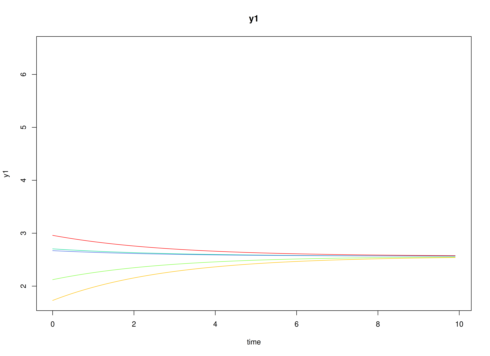
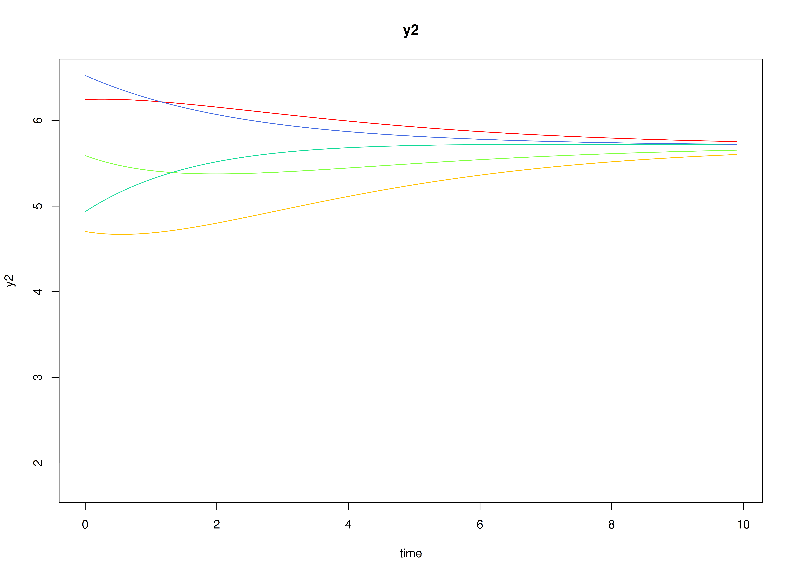
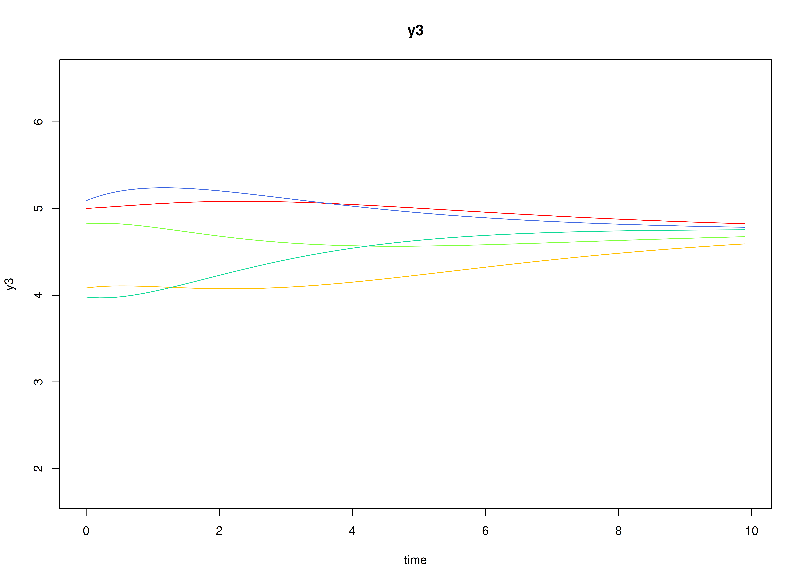
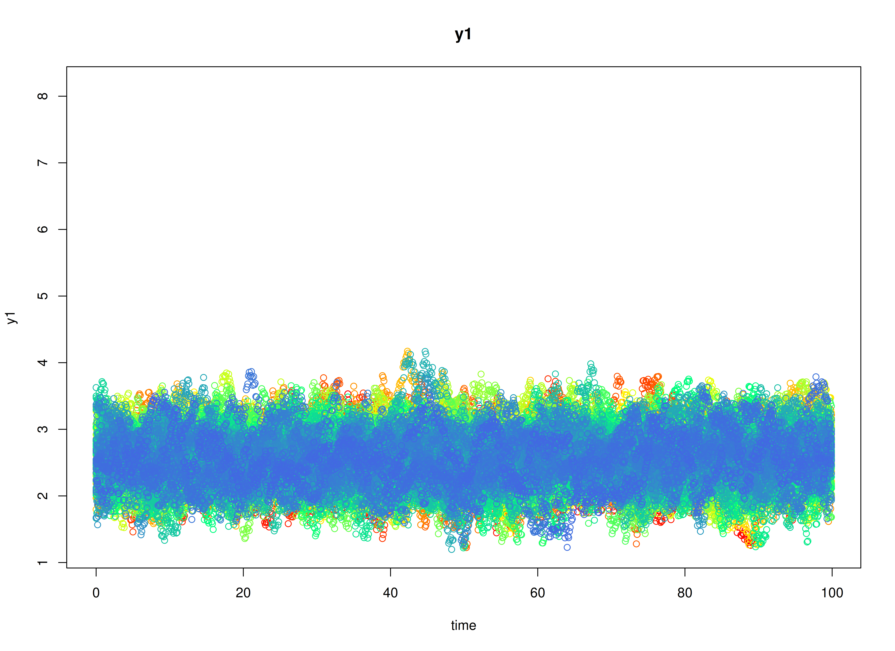
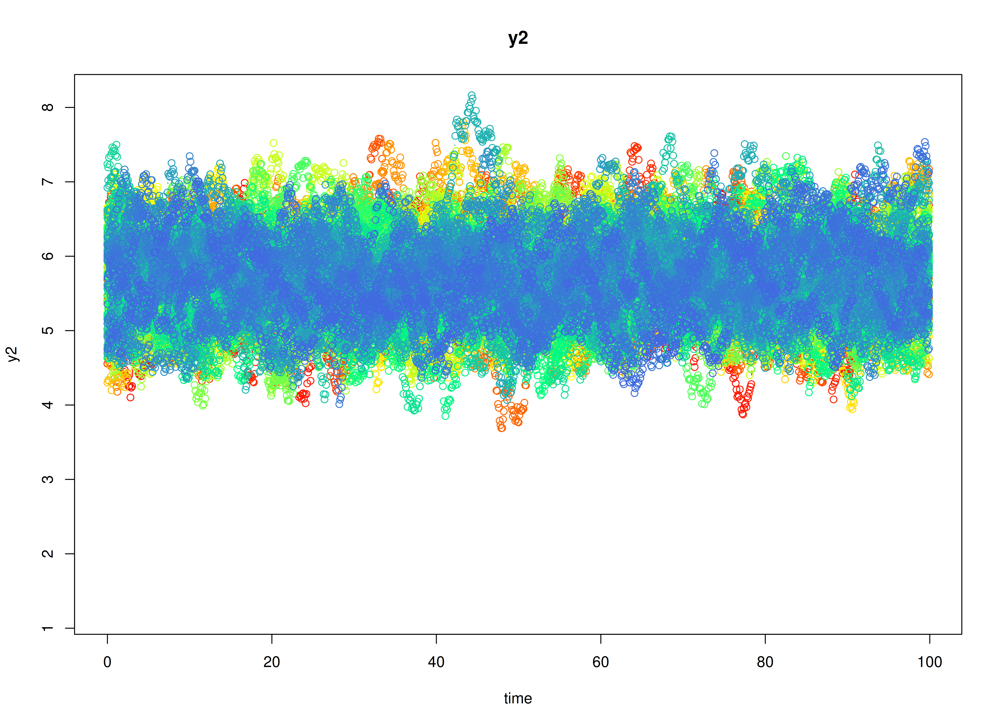
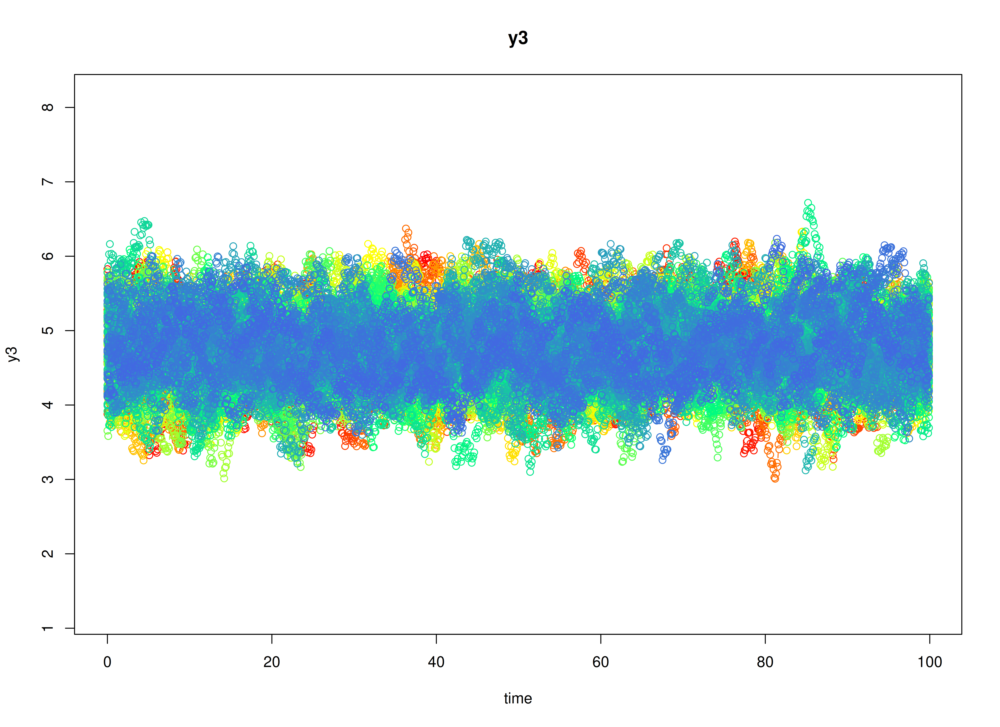

## Model

The measurement model is given by
\begin{equation}
  \mathbf{y}_{i, t}
  =
  \boldsymbol{\eta}_{i, t}
\end{equation}
where
$\mathbf{y}_{i, t}$, and
$\boldsymbol{\eta}_{i, t}$ are random variables.

The dynamic structure is given by
\begin{equation}
  \mathrm{d}
  \boldsymbol{\eta}_{i, t}
  =
  \boldsymbol{\beta}
  \left(
    \boldsymbol{\eta}_{i, t}
    -
    \boldsymbol{\mu}
  \right)
  \mathrm{d} t
  +
  \boldsymbol{\Psi}^{\frac{1}{2}}
  \mathrm{d}
  \mathbf{W}_{i, t}
\end{equation}
where
$\mathrm{d}\boldsymbol{W}$
is a Wiener process or Brownian motion,
which represents random fluctuations,
$\boldsymbol{\eta}_{i, t}$, and
$\boldsymbol{\eta}_{i, t - 1}$
are random variables,
and
$\boldsymbol{\mu}$,
$\boldsymbol{\beta}$,
and
$\boldsymbol{\Psi}$
are model parameters.
Here,
$\boldsymbol{\eta}_{i, t}$
is a vector of latent variables
at time $t$ and individual $i$, and
$\boldsymbol{\eta}_{i, t - 1}$
represents a vector of latent variables
at time $t - 1$ and individual $i$.
$\boldsymbol{\mu}$
denotes a vector of set-points,
$\boldsymbol{\beta}$
a matrix of auto
and cross effect coefficients,
and
$\boldsymbol{\Psi}$
the covariance matrix of the random fluctuations.

## Data Generation

### Notation

Let $t = 1000$ be the number of time points and $n = 100$ be the number of individuals.

Let the initial condition
$\boldsymbol{\eta}_{0}$
be given by

\begin{equation}
\boldsymbol{\eta}_{0} \sim \mathcal{N} \left( \boldsymbol{\mu}_{\boldsymbol{\eta} \mid 0}, \boldsymbol{\Sigma}_{\boldsymbol{\eta} \mid 0} \right)
\end{equation}

\begin{equation}
\boldsymbol{\mu}_{\boldsymbol{\eta} \mid 0}
=
\left(
\begin{array}{c}
  2.5648173 \\
  5.7043283 \\
  4.7496423 \\
\end{array}
\right)
\end{equation}

\begin{equation}
\boldsymbol{\Sigma}_{\boldsymbol{\eta} \mid 0}
=
\left(
\begin{array}{ccc}
  0.1401837 & 0.1245498 & 0.0264402 \\
  0.1245498 & 0.2858063 & 0.1435024 \\
  0.0264402 & 0.1435024 & 0.2059558 \\
\end{array}
\right) .
\end{equation}

Let the set-point vector $\boldsymbol{\mu}$ be given by

\begin{equation}
\boldsymbol{\mu}
=
\left(
\begin{array}{c}
  2.5648173 \\
  5.7043283 \\
  4.7496423 \\
\end{array}
\right) .
\end{equation}

Let the drift matrix $\boldsymbol{\Phi}$ be given by

\begin{equation}
\boldsymbol{\Phi}
=
\left(
\begin{array}{ccc}
  -0.3566749 & 0 & 0 \\
  0.7707534 & -0.5108256 & 0 \\
  -0.4499449 & 0.7292862 & -0.6931472 \\
\end{array}
\right) .
\end{equation}

Let the dynamic process noise $\boldsymbol{\Psi}$ be given by

\begin{equation}
\boldsymbol{\Psi}
=
\left(
\begin{array}{ccc}
  0.1 & 0 & 0 \\
  0 & 0.1 & 0 \\
  0 & 0 & 0.1 \\
\end{array}
\right) .
\end{equation}

### R Function Arguments


``` r
n
#> [1] 100
time
#> [1] 1000
mu0
#> [1] 2.564817 5.704328 4.749642
sigma0
#>            [,1]      [,2]       [,3]
#> [1,] 0.14018366 0.1245498 0.02644023
#> [2,] 0.12454982 0.2858063 0.14350238
#> [3,] 0.02644023 0.1435024 0.20595577
sigma0_l # sigma0_l <- t(chol(sigma0))
#>            [,1]      [,2]      [,3]
#> [1,] 0.37441109 0.0000000 0.0000000
#> [2,] 0.33265526 0.4185054 0.0000000
#> [3,] 0.07061819 0.2867606 0.3445827
alpha
#> [1] 0.9148060 0.9370754 0.2861395
beta
#>            [,1]       [,2]       [,3]
#> [1,] -0.3566749  0.0000000  0.0000000
#> [2,]  0.7707534 -0.5108256  0.0000000
#> [3,] -0.4499449  0.7292862 -0.6931472
psi
#>      [,1] [,2] [,3]
#> [1,]  0.1  0.0  0.0
#> [2,]  0.0  0.1  0.0
#> [3,]  0.0  0.0  0.1
psi_l # psi_l <- t(chol(psi))
#>           [,1]      [,2]      [,3]
#> [1,] 0.3162278 0.0000000 0.0000000
#> [2,] 0.0000000 0.3162278 0.0000000
#> [3,] 0.0000000 0.0000000 0.3162278
# set-point
mu
#> [1] 2.564817 5.704328 4.749642
nu
#> [1] 0 0 0
lambda
#>      [,1] [,2] [,3]
#> [1,]    1    0    0
#> [2,]    0    1    0
#> [3,]    0    0    1
theta
#>      [,1] [,2] [,3]
#> [1,]    0    0    0
#> [2,]    0    0    0
#> [3,]    0    0    0
```

### Visualizing the Dynamics Without Process Noise (n = 5 with Different Initial Condition)



### Using the `SimSSMLinSDEFixed` Function from the `simStateSpace` Package to Simulate Data

> **Note:** The `SimSSMLinSDEFixed` function uses a different set of parameter names.
> See `help(SimSSMLinSDEFixed)` for more details.


``` r
library(simStateSpace)
sim <- SimSSMLinSDEFixed(
  n = n,
  time = time,
  delta_t = 0.1,
  mu0 = mu0,
  sigma0_l = sigma0_l,
  iota = alpha,
  phi = beta,
  sigma_l = psi_l,
  nu = nu,
  lambda = lambda,
  theta_l = theta_l
)
data <- as.data.frame(sim)
head(data)
#>   id time       y1       y2       y3
#> 1  1  0.0 2.713440 6.616955 5.826304
#> 2  1  0.1 2.788586 6.625107 5.689081
#> 3  1  0.2 2.752473 6.722281 5.621800
#> 4  1  0.3 2.504163 6.706956 5.588982
#> 5  1  0.4 2.541571 6.800410 5.517594
#> 6  1  0.5 2.499550 6.830410 5.316913
summary(data)
#>        id              time             y1              y2       
#>  Min.   :  1.00   Min.   : 0.00   Min.   :1.197   Min.   :3.688  
#>  1st Qu.: 25.75   1st Qu.:24.98   1st Qu.:2.307   1st Qu.:5.342  
#>  Median : 50.50   Median :49.95   Median :2.561   Median :5.709  
#>  Mean   : 50.50   Mean   :49.95   Mean   :2.561   Mean   :5.709  
#>  3rd Qu.: 75.25   3rd Qu.:74.92   3rd Qu.:2.811   3rd Qu.:6.067  
#>  Max.   :100.00   Max.   :99.90   Max.   :4.172   Max.   :8.164  
#>        y3       
#>  Min.   :3.009  
#>  1st Qu.:4.455  
#>  Median :4.751  
#>  Mean   :4.755  
#>  3rd Qu.:5.054  
#>  Max.   :6.718
plot(sim)
```



## Model Fitting


``` r
library(OpenMx)
library(fitVARMxID)
```

The `FitVARMxID` function fits a CT-VAR model on each individual $i$.

> **Note:** Consider using the argument `ncores` to use multiple cores for parallel processing.


``` r
fit <- FitVARMxID(
  data = data,
  observed = c("y1", "y2", "y3"),
  id = "id",
  ct = TRUE,
  time = "time",
  center = TRUE,
  ncores = parallel::detectCores()
)
```

#### Parameter estimates


``` r
summary(
  fit,
  means = TRUE,
  ncores = parallel::detectCores()
)
#> Call:
#> FitVARMxID(data = data, observed = c("y1", "y2", "y3"), id = "id", 
#>     time = "time", ct = TRUE, center = TRUE, ncores = parallel::detectCores())
#> 
#> Convergence:
#> 100.0%
#> 
#> Means of the estimated paramaters per individual.
#>   mu[1,1]   mu[2,1]   mu[3,1] beta[1,1] beta[2,1] beta[3,1] beta[1,2] beta[2,2] 
#>    2.5623    5.7117    4.7566   -0.4118    0.7893   -0.4533   -0.0064   -0.5344 
#> beta[3,2] beta[1,3] beta[2,3] beta[3,3]  psi[1,1]  psi[2,1]  psi[3,1]  psi[2,2] 
#>    0.7514   -0.0148   -0.0200   -0.7402    0.1007    0.0003   -0.0002    0.0993 
#>  psi[3,2]  psi[3,3] 
#>    0.0003    0.1003
```

## References


